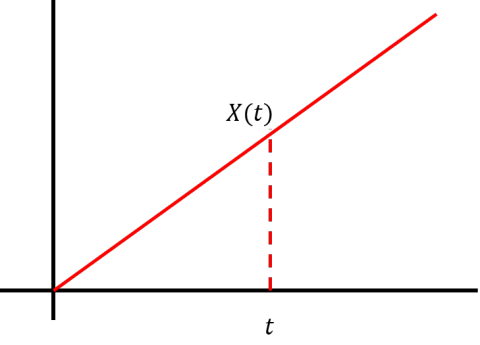
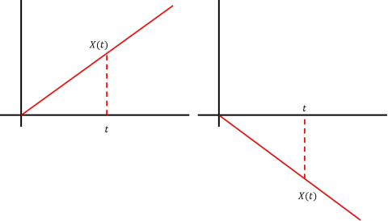
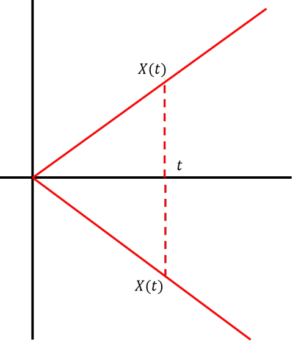
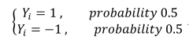
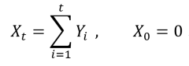
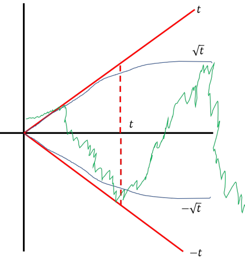

## Stochastic Processes I 

[Video Lecture : MIT OpenSource](https://www.youtube.com/watch?v=TuTmC8aOQJE)

## Content

- [Intrudoction](#1.-Stochastic-Process란?-(Introduction))
  - [확률과정의 정의](#Definition)
  - [확률과정의 예](#확률과정의-예)
  - [확률과정이 할 수 있는 일](#stochastic-process가-할-수-있는-일)
- [Simple Randomwork](#2-simple-randomwork)

---

## 1. Introduction

### Definition

Collection of randomvariables indexed by time. 

- 확률과정의 정의 : 시간축에 대해서 연속된 확률 변수들의 집합.

descrete : $X_0$, $X_1$, .... 

continuous : $\{X_t\}$ t 가 컨티뉴얼.

- 확률과정의 대안적 정의 2: probability distribution over a space of paths. 가능한 경로를 확률분포 적으로 정함.

### 확률과정의 예 

1. 

- $f(t) = t, \forall t$ with probability 1

random 하지 않음. probability가 1. 랜덤 하지 않음.

2. 

- $f(t) = t, \forall t$ with probability 0.5

- $f(t) = -t, \forall t$ with probability 0.5

two possible paths you can take. 

대안적 정의로 보면 2개의 pathway가 존재한다고 볼 수 있음. 

서로 종속이기 때문에 다른값은 종속이기 때문에 바로 알 수 있음.

3. 

for each $t$, 

$f(t) = t$ with probability 0.5

**or**

$f(t) = -t$ with probability 0.5

각 시점마다 t가 될수도 -t가 될 수도 있음. 

관측해보면, 위아래로 진동하며 발산하는 듯한 그래프를 얻을 수 있을것. 

4. 

Stochastic process는 다음과 같은 상황에서 쓰일 수도 있음.

어떤 시점 t를 지정하고 해당 시점의 과거의 값(관측치)들은 알고 있는 상황에서 미래의 값들을 알고 싶을 때.

예를들면, 주식 가격의 예측 등. 

(2)의 경우, f(t)를 알고 있기 때문에, 손쉽게 예측가능.

그러나 (3)은? 과거의 모든 값을 다 알고 있더라도, t나 -t가 될 것 같다는건 알지만, 미래의 예측은 사실상 어려움. 

**Stochastic process는 위와 같이, 확률 분포적으로 접근하여 미래의 시점 t에서 어떤 값이 나올 지에 대해서 확률적으로 정의할 수는 있음.**

### Stochastic process가 할 수 있는 일?

- (a) What are the dependencies in the sequence of the values?

만약 과거부터 오늘까지의 모든 주식의 거래 가격을 알고 있다면, 미래 주식 가격에 대한 어떠한 경향성을 제시할 수 있다.  

- (b) What is the long term behavior of the sequence?

큰수의 법칙(the law of the large numbers), 중심극한정리(centural limit theorem)

- (c) What are the booundary events?

How often will something extreme happen. like how often will a stock price drop by more than 10% for a consecutive 5 days.

How often will that happen?

---

## 2. Simple Randomwork

[위키백과 무작위행보(random work)](https://ko.wikipedia.org/wiki/%EB%AC%B4%EC%9E%91%EC%9C%84_%ED%96%89%EB%B3%B4)

### Definition 

$Y_i$ 를 i.i.d. random variable 이라고 가정.

For each t, 

then, the sequence of random variables 

$X_0, X_1, X_2 ....$

### 중심 극한정리 측면에서 본 랜덤 워크 

[위키백과 중심극한정리](https://ko.wikipedia.org/wiki/%EC%A4%91%EC%8B%AC_%EA%B7%B9%ED%95%9C_%EC%A0%95%EB%A6%AC)

만약, t가 매우 큰 수라고 가정한다면? 

variance 가 $t$

standard deviation 이 $\sqrt{t}$

Expectation 1 

이 된다. 

**이말이 무슨 말인가?**

- Standrad deviation 

충분히 큰 t 만큼 관측된 랜덤 워크는 standard deviation의 곡선을 따라갈 수 밖에 없다. (t에 대해서 $\sqrt t$ 또는 $-\sqrt t$)

- Variance 

갑자기 튄 값들중 가장 큰 값도 y=t, y=-t 직선을 넘지 못함.

위와 같이 **해석적으로, 확률적으로 이야기할 수는 있음(물론 anomaly는 존재).** 

### Property

- (i) Expectation of $X_k=0$

- (ii) Independent increment.

if look at these time 

$o = t_0 \leqslant t_1 \leqslant ... t_k $

Then 

$X_{t(i+1)} - X_{t(i)}$ are mutually independent.

각 구간별로 독립.

- (iii) Staitionary 

for all $h \geqslant  1, t \geqslant 0 $

the distribution of $X_{t+h}-X_{t}$ is the same as the distribution of $X_h$

일정 구간내 일어날 거동의 특성이 그 시작점의 영향을 받지 않음. 

- (i) + (ii) : 구간끼리 overlap 없으면 독립.

**대부분의 Stochastic process에서 위와 같은 property를 가짐.**
 

